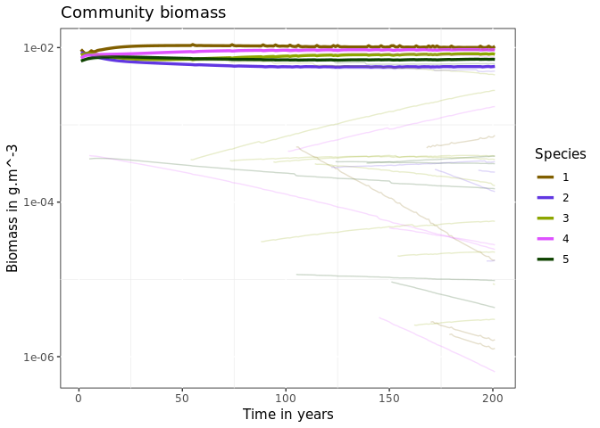
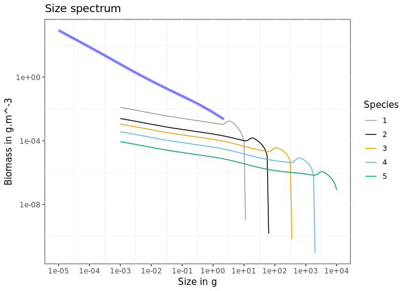
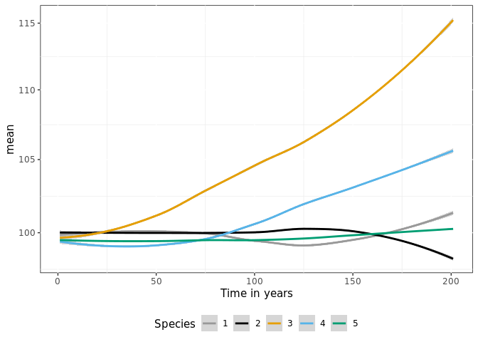

Introduction to mizerEvolution
================

## Overview

The mizerEvolution package is an extension of the mizer package (ref)
and simulate evolutionary processes within a size-structured model.
Below are described the X steps to use this package wich are described
more in details further down.

1.  [Installing mizerEvolution](#installing-mizerevolution).

2.  [Setting the model parameters](#setting-the-model-parameters).

3.  [Running a simulation](#running-a-simulation).

4.  [Additional functions](#additional-functions)

5.  [Exploring the results](#exploring-the-results).

## Installing mizerEvolution

mizerEvolution is an R package available on GitHub so you first need to
have R installed on your computer, need devtools package and then start
an R session and type:

``` r
devtools::install_github("baldrech/mizerEvolution")
```

After installing mizerEvolution, you need to load it via `library()`.

``` r
library(mizerEvolution)
```

mizerEvolution is compatible with R versions 2.0.4 and later. The source
code for mizerEvolution is hosted on
[Github.](https://github.com/baldrech/mizerEvolution)

## Setting the model parameters

As with Mizer, you first need to create an object of
`class ? MizerParams`. At the moment, the wrapper function `evoParams()`
helps you create this object. It is a tweaked version of
`newTraitParams` which add the necessary parameters to support species
evolution, therefore all the default parameters from Mizer are found
back in this function. `evoParams()` adds the `lineage` parameter which
is used to track the ancetry tree of species and the `RDD` parameter
which is used to set the recruitment function. It’s default is
`extinctionRDD()` which allow species to be removed from the ecosystem
when they reach an abundance below
10<sup> − 30</sup>*i**n**d*.*m*<sup> − 3</sup>. In mizerEvolution,
evolution comes from allowing specific parameters to change through
time. These parameters are defined in the `trait` argument of
`evoProject`. During the simulation, species will be considered as pool
of phenotypes, each with a slighty different trait value. These
phenotypes are generated semi-randomly, using only a rate of apparition
inputed by the user. The phenotypes compete between each others and are
pooled together only during the reproduction phase since they are still
part of a same species. Generating phenotypes and removing the less
abundant proxy natural selection and trait adaptation.

``` r
params <- evoParams(no_sp = 5 )
```

## Running a simulation

This is done by calling the `evoProject()` function (as in “project
forward in time”) with the model parameters. Similar to Mizer’s
`project()`, `evoProject()` projects the simulation in time while adding
new phenotypes using the `mutation` parameter (rate of apparition of new
phenotypes in the simulation). The `trait` parameter determines which
species parameter is going to vary during the simulation and
differentiate phenotypes between each other within each species. The
default is set to `w_mat`, the maturation size.

``` r
sim <- evoProject(params = params, t_max = 200, mutation = 3, trait = "beta")
#> [1] "Data handling"
```

This produces an object of class `MizerSim` which contains the results
of the simulation.

## Additional functions

The parameter `initPool` in `evoProject()` allows to initiate species as
pool of phenotypes. Instead of starting with species composed of one
phenotypes each, having `initPool = 5` will add 5 randomly generated
phenotypes per species at the start of the simulation (for a total of 6
phenotypes per species). The parameter `initCondition` allows to input a
mizer object instead of a mizer param. This allows to start simulations
from previously saved simulations.

## Exploring the results

After a simulation has been run, the results can be examined using a
range of `?plotting_functions`, `?summary_functions` and
`?indicator_functions`. The `plot()` function combines several of these
plots into one:

``` r
plot(sim)
```

<!-- -->

In this default Mizer plot, added phenotypes are considered as new
species.

<!-- Just as an example: we might be interested in how the proportion of large fish -->
<!-- varies over time. We can get the proportion of Herrings in terms of biomass that -->
<!-- have a weight above 50g in each of the 10 years: -->
<!-- ```{r} -->
<!-- getProportionOfLargeFish(sim,  -->
<!--                          #species = "Herring",  -->
<!--                          threshold_w = 50,  -->
<!--                          biomass_proportion = TRUE) -->
<!-- ``` -->
<!-- We can then use the full power of R to work with these results. -->
<!-- The functionality provided by mizer to explore the simulation results is more -->
<!-- fully described in  -->
<!-- [the section on exploring the simulation results.](exploring_the_simulation_results.html) -->

## Package functionalities

-   New species are copy of existing ones albeit with a change to one
    trait.

-   Each projections containing a new species is independent of the
    others. They are saved in a temporary folder before being binded at
    the end of the simulation

-   New plot functions allow to explore the evolutionary results

## Algorithm

Instead of projecting for the entire time one mizer class object, the
evoProject() will only project for a shorter amount of time, until a new
species needs to be added in the ecosystem. When adding a new species
(time chosen randomly), the projection stops, a new species is added
with `addSpecies()`. At the moment, to simulate mutations, the new
species is a copy of an existing one albeit for a slight difference in
one trait: the maturation size. Further update will include more than
one trait (any parameter in the model can become a trait) and mixed
reproduction as at the moment new species included this way reproduce
independtly from their “parent” and therefore make 2 diffent species.
Afte adding a new species, a new projection starts. It means that one
simulation is in reality a string of small projection. The `finalTouch`
function takes all theses projection and makes them into one MizerObject
wich is usable by any vanilla Mizer functions.

## Plotting evolutionary results

base Mizer functions cannot handle species being formed of different
“sub-species” so all plot functions have been updated to show species or
their “phenotypes” using the `lineage` parameter

Checking the biomass through time. The default plot has a colorblind of
10 colors and won’t work with more than 10 species, if you want to
personalise the plot, use `returnData = TRUE`.

### plotDynamics

plotDynamics output the same results as plotBiomass (species’ biomass
thorugh time) if the phenotype argument is set to FALSE

``` r
plotDynamics(sim, phenotype = F)
```

<!-- -->

Showing the phenotypes as semi-transparent lines, with phenotype = TRUE
(default)

``` r
plotDynamics(sim, phenotype = T)
```

<!-- -->

The species argument displays all the phenotypes of one species only
(take species identity as value)

``` r
plotDynamics(sim,species = 2)
```

<!-- -->

The trait value of the phenotypes can be displayed per phenotypes as a
continuous gradient, only available when only one species is selected

``` r
plotDynamics(sim, species = 2, trait = sim@params@species_params$beta)
```

<!-- -->

The SpIdx argument selects for a subset of species

``` r
plotDynamics(sim,SpIdx = c(1,2,3))
```

<!-- -->

### plotSS

The size spectrum plot can display abundance density or biomass with the
biomass argument

``` r
plotSS(sim,biomass = F)
```

<!-- -->

``` r
plotSS(sim,biomass = T)
```

<!-- -->

It can also display 3 levels of grouping: community, species, phenotypes

``` r
plotSS(sim, community = T)
```

<!-- -->

``` r
plotSS(sim)
```

<!-- -->

``` r
plotSS(sim, species = F)
```

<!-- -->

### Feeding level

``` r
plotevoFeeding(sim)
```

<!-- -->

### Growth

``` r
plotevoGrowth(sim)
```

<!-- -->

## Mortality

``` r
plotevoMortality(sim)
```

<!-- -->

## Trait evolution

``` r
plotevoTrait(sim, traitID = "beta", returnData = F)
```

<!-- -->

<!-- The following plots are not available on this version yet but are examples of what you can get with biomass data and trait evolution through time. -->
<!-- The biomass per trait value of one species through time -->
<!-- The trait value through time. It's shown at the species level which is the biomass weighted average of the species' phenotypes -->
<!-- Looking at the fitness of one species (total spawn output throughtout lifetime) per trait value -->
<!-- When two traits are involved -->
<!-- Checking the average number of phenotypes per species through time. -->

## Species invasion

Instead of generating phenotypic diversity within existing species, the
model can instead introduce mutants in an existing ecosystem. One just
needs to give a data frame to the mutation argument instead of a
numeric.

``` r
params<- evoParams()

alien <- params@species_params[4:5,] # copy existing data frame
alien$h <- 50 # change some parameters
alien$alpha <- .6
alien$time <- c(50,75) # when are the invasive species coming in?
alien$lineage <- factor(c(12,13),levels = c(12,13)) # need to specify a lineage for these species otherwise they will be related to the endemic ones
alien$init_n_multiplier <- NULL # multiplier for the initial abundance
alien$species <- as.character(c(12,13))

#important: for now need to add new species following the number of existing species (e.g. generated ecosystem contains 11 species so first invading species is 12). Does not work otherwise
sim <- evoProject(params = params, alien = alien, mutation = 0)
#> [1] "Data handling"
plotDynamics(sim)
```

<!-- -->
