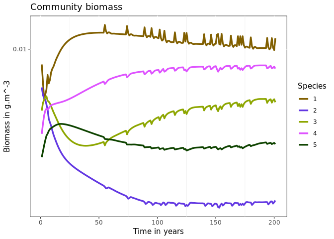
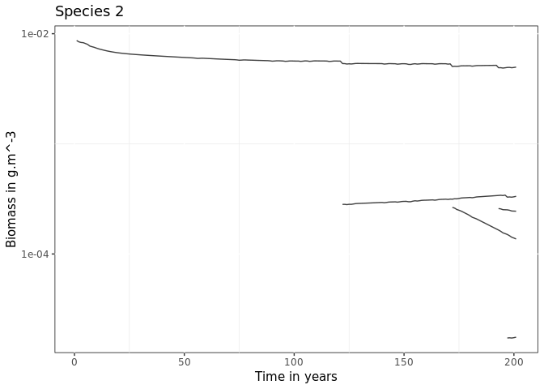
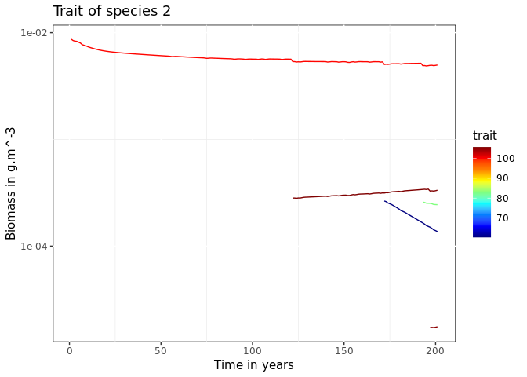
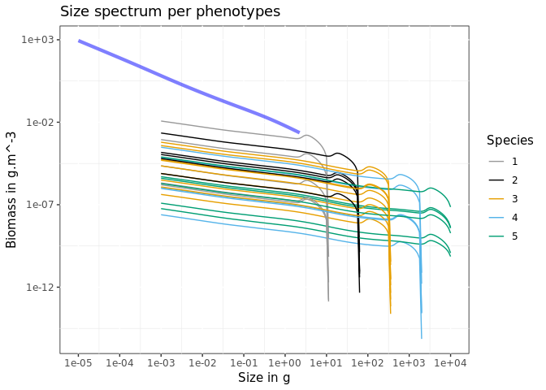
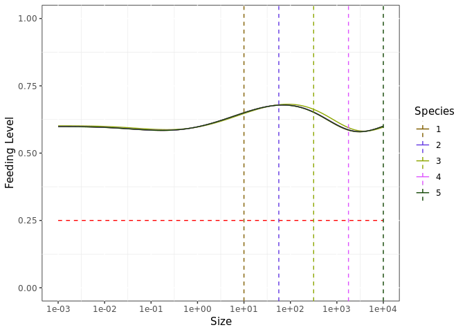
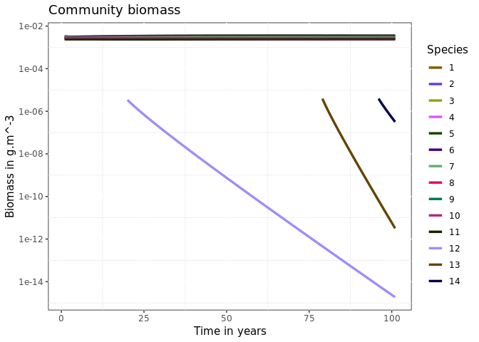
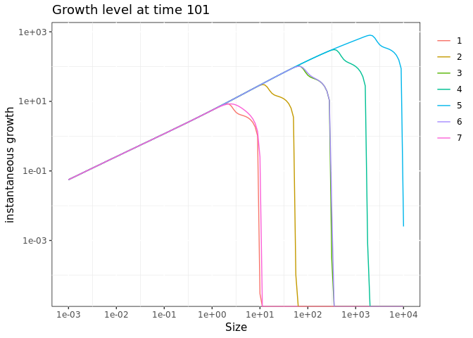

Introduction to mizerEvolution
================

## Overview

The mizerEvolution package is an extension of the mizer package (https://github.com/sizespectrum/mizer)
and simulate evolutionary processes within a size-structured model.
Below are described the 5 steps to use this package which are described
more in details further down.

1.  [Installing mizerEvolution](#installing-mizerevolution).

2.  [Setting the model parameters](#setting-the-model-parameters).

3.  [Running a simulation](#running-a-simulation).

4.  [Additional functions](#additional-functions)

5.  [Exploring the results](#exploring-the-results).

## Installing mizerEvolution

mizerEvolution is an R package available on GitHub so you first need to
have R installed on your computer, need devtools package and then start
an R session and type:

``` r
devtools::install_github("baldrech/mizerEvolution")
```

After installing mizerEvolution, you need to load it via `library()`.

``` r
library(mizerEvolution)
```

mizerEvolution is compatible with R versions 2.0.4 and later. The source
code for mizerEvolution is hosted on
[Github.](https://github.com/baldrech/mizerEvolution)

## Setting the model parameters

As with Mizer, you first need to create an object of
`class MizerParams`. At the moment, the wrapper function `evoParams()`
helps you create this object. It is a tweaked version of
`newTraitParams` which add the necessary parameters to support species
evolution, therefore all the default parameters from Mizer are found
back in this function. `evoParams()` adds the `lineage` parameter which
is used to track the ancetry tree of species and the `RDD` parameter
which is used to set the recruitment function. It’s default is
`extinctionRDD()` which allow species to be removed from the ecosystem
when they reach an abundance below
10<sup> − 30</sup>*i**n**d*.*m*<sup> − 3</sup>. In mizerEvolution,
evolution comes from allowing specific parameters to change through
time. These parameters are defined in the `trait` argument of
`evoProject`. During the simulation, species will be considered as pool
of phenotypes, each with a slighty different trait value. These
phenotypes are generated semi-randomly, using only a rate of apparition
inputed by the user. The phenotypes compete between each others and are
pooled together only during the reproduction phase since they are still
part of a same species. Generating phenotypes and removing the less
abundant proxy natural selection and trait adaptation.

``` r
params <- evoParams(no_sp = 5 )
```

## Running a simulation

This is done by calling the `evoProject()` function (as in “project
forward in time”) with the model parameters. Similar to Mizer’s
`project()`, `evoProject()` projects the simulation in time while adding
new phenotypes using the `mutation` parameter (rate of apparition of new
phenotypes in the simulation). The `trait` parameter determines which
species parameter is going to vary during the simulation and
differentiate phenotypes between each other within each species. The
default is set to `w_mat`, the maturation size.

``` r
sim <- evoProject(params = params, t_max = 200, mutation = 3, trait = "beta")
#> [1] "Data handling"
```

This produces an object of class `MizerSim` which contains the results
of the simulation.

## Additional functions

The parameter `initPool` in `evoProject()` allows to initiate species as
pool of phenotypes. Instead of starting with species composed of one
phenotypes each, having `initPool = 5` will add 5 randomly generated
phenotypes per species at the start of the simulation (for a total of 6
phenotypes per species). The parameter `initCondition` allows to input a
mizer object instead of a mizer param. This allows to start simulations
from previously saved simulations.

## Exploring the results

After a simulation has been run, the results can be examined using a
range of `plotting_functions`, `summary_functions` and
`indicator_functions`. The `plot()` function combines several of these
plots into one:

``` r
plot(sim)
```

<!-- -->

In this default Mizer plot, added phenotypes are considered as new
species.

<!-- Just as an example: we might be interested in how the proportion of large fish -->
<!-- varies over time. We can get the proportion of Herrings in terms of biomass that -->
<!-- have a weight above 50g in each of the 10 years: -->
<!-- ```{r} -->
<!-- getProportionOfLargeFish(sim,  -->
<!--                          #species = "Herring",  -->
<!--                          threshold_w = 50,  -->
<!--                          biomass_proportion = TRUE) -->
<!-- ``` -->
<!-- We can then use the full power of R to work with these results. -->
<!-- The functionality provided by mizer to explore the simulation results is more -->
<!-- fully described in  -->
<!-- [the section on exploring the simulation results.](exploring_the_simulation_results.html) -->

## Package functionalities

-   New species are copy of existing ones albeit with a change to one
    trait.

-   Each projections containing a new species is independent of the
    others. They are saved in a temporary folder before being binded at
    the end of the simulation

-   New plot functions allow to explore the evolutionary results

## Algorithm

Instead of projecting for the entire time one mizer class object, the
evoProject() will only project for a shorter amount of time, until a new
species needs to be added in the ecosystem. When adding a new species
(time chosen randomly), the projection stops, a new species is added
with `addSpecies()`. At the moment, to simulate mutations, the new
species is a copy of an existing one albeit for a slight difference in
one trait: the maturation size. Further update will include more than
one trait (any parameter in the model can become a trait) and mixed
reproduction as at the moment new species included this way reproduce
independtly from their “parent” and therefore make 2 diffent species.
Afte adding a new species, a new projection starts. It means that one
simulation is in reality a string of small projection. The `finalTouch`
function takes all theses projection and makes them into one MizerObject
wich is usable by any vanilla Mizer functions.

## Plotting evolutionary results

base Mizer functions cannot handle species being formed of different
“sub-species” so all plot functions have been updated to show species or
their “phenotypes” using the `lineage` parameter

Checking the biomass through time. The default plot has a colorblind of
10 colors and won’t work with more than 10 species, if you want to
personalise the plot, use `returnData = TRUE`.

### plotDynamics

plotDynamics output the same results as plotBiomass (species’ biomass
thorugh time) if the phenotype argument is set to FALSE

``` r
plotDynamics(sim, phenotype = F)
```

<!-- -->

Showing the phenotypes as semi-transparent lines, with phenotype = TRUE
(default)

``` r
plotDynamics(sim, phenotype = T)
```

<!-- -->

The species argument displays all the phenotypes of one species only
(take species identity as value)

``` r
plotDynamics(sim,species = 2)
```

<!-- -->

The trait value of the phenotypes can be displayed per phenotypes as a
continuous gradient, only available when only one species is selected

``` r
plotDynamics(sim, species = 2, trait = sim@params@species_params$beta)
```

<!-- -->

The SpIdx argument selects for a subset of species

``` r
plotDynamics(sim,SpIdx = c(1,2,3))
```

<!-- -->

### plotSS

The size spectrum plot can display abundance density or biomass with the
biomass argument

``` r
plotSS(sim,biomass = F)
```

<!-- -->

``` r
plotSS(sim,biomass = T)
```

<!-- -->

It can also display 3 levels of grouping: community, species, phenotypes

``` r
plotSS(sim, community = T)
```

<!-- -->

``` r
plotSS(sim)
```

<!-- -->

``` r
plotSS(sim, species = F)
```

<!-- -->

### Feeding level

``` r
plotevoFeeding(sim)
```

<!-- -->

### Growth

``` r
plotevoGrowth(sim)
```

<!-- -->

## Mortality

``` r
plotevoMortality(sim)
```

<!-- -->

## Trait evolution

``` r
plotevoTrait(sim, traitID = "beta", returnData = F)
```

<!-- -->

<!-- The following plots are not available on this version yet but are examples of what you can get with biomass data and trait evolution through time. -->
<!-- The biomass per trait value of one species through time -->
<!-- The trait value through time. It's shown at the species level which is the biomass weighted average of the species' phenotypes -->
<!-- Looking at the fitness of one species (total spawn output throughtout lifetime) per trait value -->
<!-- When two traits are involved -->
<!-- Checking the average number of phenotypes per species through time. -->

## Species invasion

Instead of generating phenotypic diversity within existing species, the
model can instead introduce mutants in an existing ecosystem. One just
needs to give a data frame to the mutation argument instead of a
numeric.

``` r
params<- evoParams()

alien <- params@species_params[4:5,] # copy existing data frame
alien$h <- 50 # change some parameters
alien$alpha <- .6
alien$time <- c(50,75) # when are the invasive species coming in?
alien$lineage <- factor(c(12,13),levels = c(12,13)) # need to specify a lineage for these species otherwise they will be related to the endemic ones
alien$init_n_multiplier <- NULL # multiplier for the initial abundance
alien$species <- as.character(c(12,13))

#important: for now need to add new species following the number of existing species (e.g. generated ecosystem contains 11 species so first invading species is 12). Does not work otherwise
sim <- evoProject(params = params, alien = alien, mutation = 0)
#>    species w_min       w_inf       w_mat w_min_idx  h    gamma ks  f0   fc beta
#> 1        1 0.001    10.00000    2.511886         1 40 2754.672  4 0.6 0.25  100
#> 2        2 0.001    19.95262    5.011872         1 40 2754.672  4 0.6 0.25  100
#> 3        3 0.001    39.81072   10.000000         1 40 2754.672  4 0.6 0.25  100
#> 4        4 0.001    79.43282   19.952623         1 40 2754.672  4 0.6 0.25  100
#> 5        5 0.001   158.48932   39.810717         1 40 2754.672  4 0.6 0.25  100
#> 6        6 0.001   316.22777   79.432823         1 40 2754.672  4 0.6 0.25  100
#> 7        7 0.001   630.95734  158.489319         1 40 2754.672  4 0.6 0.25  100
#> 8        8 0.001  1258.92541  316.227766         1 40 2754.672  4 0.6 0.25  100
#> 9        9 0.001  2511.88643  630.957344         1 40 2754.672  4 0.6 0.25  100
#> 10      10 0.001  5011.87234 1258.925412         1 40 2754.672  4 0.6 0.25  100
#> 11      11 0.001 10000.00000 2511.886432         1 40 2754.672  4 0.6 0.25  100
#> 12      12 0.001    79.43282   19.952623         1 50 2754.672  4 0.6 0.25  100
#>    sigma z0 alpha     erepro interaction_resource         n         p         q
#> 1    1.3  0   0.4 0.11952402                    1 0.6666667 0.6666667 0.7166667
#> 2    1.3  0   0.4 0.09480694                    1 0.6666667 0.6666667 0.7166667
#> 3    1.3  0   0.4 0.07513533                    1 0.6666667 0.6666667 0.7166667
#> 4    1.3  0   0.4 0.05979226                    1 0.6666667 0.6666667 0.7166667
#> 5    1.3  0   0.4 0.04809642                    1 0.6666667 0.6666667 0.7166667
#> 6    1.3  0   0.4 0.03924217                    1 0.6666667 0.6666667 0.7166667
#> 7    1.3  0   0.4 0.03232946                    1 0.6666667 0.6666667 0.7166667
#> 8    1.3  0   0.4 0.02658807                    1 0.6666667 0.6666667 0.7166667
#> 9    1.3  0   0.4 0.02163458                    1 0.6666667 0.6666667 0.7166667
#> 10   1.3  0   0.4 0.01743907                    1 0.6666667 0.6666667 0.7166667
#> 11   1.3  0   0.4 0.01403004                    1 0.6666667 0.6666667 0.7166667
#> 12   1.3  0   0.6 0.05979226                    1 0.6666667 0.6666667 0.7166667
#>    pred_kernel_type k     w_mat25 m       R_max lineage ea_int ca_int zeta pop
#> 1         lognormal 0    2.250546 1 1.032270637       1      0      0  0.2   1
#> 2         lognormal 0    4.490429 1 0.635115196       2      0      0  0.2   1
#> 3         lognormal 0    8.959585 1 0.390761200       3      0      0  0.2   1
#> 4         lognormal 0   17.876722 1 0.240419874       4      0      0  0.2   1
#> 5         lognormal 0   35.668749 1 0.147920816       5      0      0  0.2   1
#> 6         lognormal 0   71.168510 1 0.091009814       6      0      0  0.2   1
#> 7         lognormal 0  141.999846 1 0.055994730       7      0      0  0.2   1
#> 8         lognormal 0  283.326942 1 0.034451337       8      0      0  0.2   1
#> 9         lognormal 0  565.311571 1 0.021196542       9      0      0  0.2   1
#> 10        lognormal 0 1127.944873 1 0.013041392      10      0      0  0.2   1
#> 11        lognormal 0 2250.545898 1 0.008023851      11      0      0  0.2   1
#> 12        lognormal 0   17.876722 1 0.240419874      12      0      0  0.2   1
#>      ext time
#> 1  FALSE   NA
#> 2  FALSE   NA
#> 3  FALSE   NA
#> 4  FALSE   NA
#> 5  FALSE   NA
#> 6  FALSE   NA
#> 7  FALSE   NA
#> 8  FALSE   NA
#> 9  FALSE   NA
#> 10 FALSE   NA
#> 11 FALSE   NA
#> 12 FALSE   50
#>    species w_min       w_inf       w_mat w_min_idx  h    gamma ks  f0   fc beta
#> 1        1 0.001    10.00000    2.511886         1 40 2754.672  4 0.6 0.25  100
#> 2        2 0.001    19.95262    5.011872         1 40 2754.672  4 0.6 0.25  100
#> 3        3 0.001    39.81072   10.000000         1 40 2754.672  4 0.6 0.25  100
#> 4        4 0.001    79.43282   19.952623         1 40 2754.672  4 0.6 0.25  100
#> 5        5 0.001   158.48932   39.810717         1 40 2754.672  4 0.6 0.25  100
#> 6        6 0.001   316.22777   79.432823         1 40 2754.672  4 0.6 0.25  100
#> 7        7 0.001   630.95734  158.489319         1 40 2754.672  4 0.6 0.25  100
#> 8        8 0.001  1258.92541  316.227766         1 40 2754.672  4 0.6 0.25  100
#> 9        9 0.001  2511.88643  630.957344         1 40 2754.672  4 0.6 0.25  100
#> 10      10 0.001  5011.87234 1258.925412         1 40 2754.672  4 0.6 0.25  100
#> 11      11 0.001 10000.00000 2511.886432         1 40 2754.672  4 0.6 0.25  100
#> 12      12 0.001    79.43282   19.952623         1 50 2754.672  4 0.6 0.25  100
#> 13      13 0.001   158.48932   39.810717         1 50 2754.672  4 0.6 0.25  100
#>    sigma z0 alpha     erepro interaction_resource         n         p         q
#> 1    1.3  0   0.4 0.11952402                    1 0.6666667 0.6666667 0.7166667
#> 2    1.3  0   0.4 0.09480694                    1 0.6666667 0.6666667 0.7166667
#> 3    1.3  0   0.4 0.07513533                    1 0.6666667 0.6666667 0.7166667
#> 4    1.3  0   0.4 0.05979226                    1 0.6666667 0.6666667 0.7166667
#> 5    1.3  0   0.4 0.04809642                    1 0.6666667 0.6666667 0.7166667
#> 6    1.3  0   0.4 0.03924217                    1 0.6666667 0.6666667 0.7166667
#> 7    1.3  0   0.4 0.03232946                    1 0.6666667 0.6666667 0.7166667
#> 8    1.3  0   0.4 0.02658807                    1 0.6666667 0.6666667 0.7166667
#> 9    1.3  0   0.4 0.02163458                    1 0.6666667 0.6666667 0.7166667
#> 10   1.3  0   0.4 0.01743907                    1 0.6666667 0.6666667 0.7166667
#> 11   1.3  0   0.4 0.01403004                    1 0.6666667 0.6666667 0.7166667
#> 12   1.3  0   0.6 0.05979226                    1 0.6666667 0.6666667 0.7166667
#> 13   1.3  0   0.6 0.04809642                    1 0.6666667 0.6666667 0.7166667
#>    pred_kernel_type k     w_mat25 m       R_max lineage ea_int ca_int zeta pop
#> 1         lognormal 0    2.250546 1 1.032270637       1      0      0  0.2   1
#> 2         lognormal 0    4.490429 1 0.635115196       2      0      0  0.2   1
#> 3         lognormal 0    8.959585 1 0.390761200       3      0      0  0.2   1
#> 4         lognormal 0   17.876722 1 0.240419874       4      0      0  0.2   1
#> 5         lognormal 0   35.668749 1 0.147920816       5      0      0  0.2   1
#> 6         lognormal 0   71.168510 1 0.091009814       6      0      0  0.2   1
#> 7         lognormal 0  141.999846 1 0.055994730       7      0      0  0.2   1
#> 8         lognormal 0  283.326942 1 0.034451337       8      0      0  0.2   1
#> 9         lognormal 0  565.311571 1 0.021196542       9      0      0  0.2   1
#> 10        lognormal 0 1127.944873 1 0.013041392      10      0      0  0.2   1
#> 11        lognormal 0 2250.545898 1 0.008023851      11      0      0  0.2   1
#> 12        lognormal 0   17.876722 1 0.240419874      12      0      0  0.2   1
#> 13        lognormal 0   35.668749 1 0.147920816      13      0      0  0.2   1
#>      ext time
#> 1  FALSE   NA
#> 2  FALSE   NA
#> 3  FALSE   NA
#> 4  FALSE   NA
#> 5  FALSE   NA
#> 6  FALSE   NA
#> 7  FALSE   NA
#> 8  FALSE   NA
#> 9  FALSE   NA
#> 10 FALSE   NA
#> 11 FALSE   NA
#> 12 FALSE   50
#> 13 FALSE   75
#> [1] "Data handling"
plotDynamics(sim)
```

<!-- -->

Randomly introducing alien species. By giving an integer to the `alien`
argument, this will become a rate per thousand of invation rate. The
`alien_n_init` controls the initial level of abundance when introducing
an invasive species. It is a multiplier of the inital abundance
calculated to create a size spectrum. Default is set to `NULL`, making
it `kappa/1000`.

``` r
params <- evoParams()

sim <- evoProject(params = params, mutation = 0, alien = 3, alien_init_n = NULL)
#> [1] "alien trying to invade ecosystem"
#>    species w_min       w_inf       w_mat w_min_idx      h        gamma       ks
#> 1        1 0.001    10.00000    2.511886         1  40.00 2.754672e+03 4.000000
#> 2        2 0.001    19.95262    5.011872         1  40.00 2.754672e+03 4.000000
#> 3        3 0.001    39.81072   10.000000         1  40.00 2.754672e+03 4.000000
#> 4        4 0.001    79.43282   19.952623         1  40.00 2.754672e+03 4.000000
#> 5        5 0.001   158.48932   39.810717         1  40.00 2.754672e+03 4.000000
#> 6        6 0.001   316.22777   79.432823         1  40.00 2.754672e+03 4.000000
#> 7        7 0.001   630.95734  158.489319         1  40.00 2.754672e+03 4.000000
#> 8        8 0.001  1258.92541  316.227766         1  40.00 2.754672e+03 4.000000
#> 9        9 0.001  2511.88643  630.957344         1  40.00 2.754672e+03 4.000000
#> 10      10 0.001  5011.87234 1258.925412         1  40.00 2.754672e+03 4.000000
#> 11      11 0.001 10000.00000 2511.886432         1  40.00 2.754672e+03 4.000000
#> 12      12 0.001  3940.80059  339.489082         1 126.02 1.637959e-10 3.773004
#>     f0   fc     beta    sigma         z0 alpha     erepro interaction_resource
#> 1  0.6 0.25    100.0 1.300000 0.00000000   0.4 0.11952402                    1
#> 2  0.6 0.25    100.0 1.300000 0.00000000   0.4 0.09480694                    1
#> 3  0.6 0.25    100.0 1.300000 0.00000000   0.4 0.07513533                    1
#> 4  0.6 0.25    100.0 1.300000 0.00000000   0.4 0.05979226                    1
#> 5  0.6 0.25    100.0 1.300000 0.00000000   0.4 0.04809642                    1
#> 6  0.6 0.25    100.0 1.300000 0.00000000   0.4 0.03924217                    1
#> 7  0.6 0.25    100.0 1.300000 0.00000000   0.4 0.03232946                    1
#> 8  0.6 0.25    100.0 1.300000 0.00000000   0.4 0.02658807                    1
#> 9  0.6 0.25    100.0 1.300000 0.00000000   0.4 0.02163458                    1
#> 10 0.6 0.25    100.0 1.300000 0.00000000   0.4 0.01743907                    1
#> 11 0.6 0.25    100.0 1.300000 0.00000000   0.4 0.01403004                    1
#> 12 0.6 0.25 396272.8 2.265746 0.03798596   0.6 1.00000000                    1
#>            n         p         q pred_kernel_type k     w_mat25 m        R_max
#> 1  0.6666667 0.6666667 0.7166667        lognormal 0    2.250546 1  1.032270637
#> 2  0.6666667 0.6666667 0.7166667        lognormal 0    4.490429 1  0.635115196
#> 3  0.6666667 0.6666667 0.7166667        lognormal 0    8.959585 1  0.390761200
#> 4  0.6666667 0.6666667 0.7166667        lognormal 0   17.876722 1  0.240419874
#> 5  0.6666667 0.6666667 0.7166667        lognormal 0   35.668749 1  0.147920816
#> 6  0.6666667 0.6666667 0.7166667        lognormal 0   71.168510 1  0.091009814
#> 7  0.6666667 0.6666667 0.7166667        lognormal 0  141.999846 1  0.055994730
#> 8  0.6666667 0.6666667 0.7166667        lognormal 0  283.326942 1  0.034451337
#> 9  0.6666667 0.6666667 0.7166667        lognormal 0  565.311571 1  0.021196542
#> 10 0.6666667 0.6666667 0.7166667        lognormal 0 1127.944873 1  0.013041392
#> 11 0.6666667 0.6666667 0.7166667        lognormal 0 2250.545898 1  0.008023851
#> 12 0.6666667 0.7000000 0.7166667        lognormal 0  304.168115 1 10.000000000
#>    lineage ea_int ca_int zeta pop   ext      k_vb
#> 1        1      0      0  0.2   1 FALSE        NA
#> 2        2      0      0  0.2   1 FALSE        NA
#> 3        3      0      0  0.2   1 FALSE        NA
#> 4        4      0      0  0.2   1 FALSE        NA
#> 5        5      0      0  0.2   1 FALSE        NA
#> 6        6      0      0  0.2   1 FALSE        NA
#> 7        7      0      0  0.2   1 FALSE        NA
#> 8        8      0      0  0.2   1 FALSE        NA
#> 9        9      0      0  0.2   1 FALSE        NA
#> 10      10      0      0  0.2   1 FALSE        NA
#> 11      11      0      0  0.2   1 FALSE        NA
#> 12      12      0      0  0.2  19 FALSE 0.7476512
#> [1] "alien trying to invade ecosystem"
#>    species w_min       w_inf       w_mat w_min_idx         h        gamma
#> 1        1 0.001    10.00000    2.511886         1  40.00000 2.754672e+03
#> 2        2 0.001    19.95262    5.011872         1  40.00000 2.754672e+03
#> 3        3 0.001    39.81072   10.000000         1  40.00000 2.754672e+03
#> 4        4 0.001    79.43282   19.952623         1  40.00000 2.754672e+03
#> 5        5 0.001   158.48932   39.810717         1  40.00000 2.754672e+03
#> 6        6 0.001   316.22777   79.432823         1  40.00000 2.754672e+03
#> 7        7 0.001   630.95734  158.489319         1  40.00000 2.754672e+03
#> 8        8 0.001  1258.92541  316.227766         1  40.00000 2.754672e+03
#> 9        9 0.001  2511.88643  630.957344         1  40.00000 2.754672e+03
#> 10      10 0.001  5011.87234 1258.925412         1  40.00000 2.754672e+03
#> 11      11 0.001 10000.00000 2511.886432         1  40.00000 2.754672e+03
#> 12      12 0.001  3940.80059  339.489082         1 126.01997 1.637959e-10
#> 13      13 0.001   277.17742   46.981701         1  41.45574 6.588478e-11
#>          ks  f0   fc     beta    sigma         z0 alpha     erepro
#> 1  4.000000 0.6 0.25    100.0 1.300000 0.00000000   0.4 0.11952402
#> 2  4.000000 0.6 0.25    100.0 1.300000 0.00000000   0.4 0.09480694
#> 3  4.000000 0.6 0.25    100.0 1.300000 0.00000000   0.4 0.07513533
#> 4  4.000000 0.6 0.25    100.0 1.300000 0.00000000   0.4 0.05979226
#> 5  4.000000 0.6 0.25    100.0 1.300000 0.00000000   0.4 0.04809642
#> 6  4.000000 0.6 0.25    100.0 1.300000 0.00000000   0.4 0.03924217
#> 7  4.000000 0.6 0.25    100.0 1.300000 0.00000000   0.4 0.03232946
#> 8  4.000000 0.6 0.25    100.0 1.300000 0.00000000   0.4 0.02658807
#> 9  4.000000 0.6 0.25    100.0 1.300000 0.00000000   0.4 0.02163458
#> 10 4.000000 0.6 0.25    100.0 1.300000 0.00000000   0.4 0.01743907
#> 11 4.000000 0.6 0.25    100.0 1.300000 0.00000000   0.4 0.01403004
#> 12 3.773004 0.6 0.25 396272.8 2.265746 0.03798596   0.6 1.00000000
#> 13 2.074027 0.6 0.25 207208.2 1.917540 0.09202348   0.6 1.00000000
#>    interaction_resource         n         p         q pred_kernel_type k
#> 1                     1 0.6666667 0.6666667 0.7166667        lognormal 0
#> 2                     1 0.6666667 0.6666667 0.7166667        lognormal 0
#> 3                     1 0.6666667 0.6666667 0.7166667        lognormal 0
#> 4                     1 0.6666667 0.6666667 0.7166667        lognormal 0
#> 5                     1 0.6666667 0.6666667 0.7166667        lognormal 0
#> 6                     1 0.6666667 0.6666667 0.7166667        lognormal 0
#> 7                     1 0.6666667 0.6666667 0.7166667        lognormal 0
#> 8                     1 0.6666667 0.6666667 0.7166667        lognormal 0
#> 9                     1 0.6666667 0.6666667 0.7166667        lognormal 0
#> 10                    1 0.6666667 0.6666667 0.7166667        lognormal 0
#> 11                    1 0.6666667 0.6666667 0.7166667        lognormal 0
#> 12                    1 0.6666667 0.7000000 0.7166667        lognormal 0
#> 13                    1 0.6666667 0.7000000 0.7166667        lognormal 0
#>        w_mat25 m        R_max lineage ea_int ca_int zeta pop   ext      k_vb
#> 1     2.250546 1  1.032270637       1      0      0  0.2   1 FALSE        NA
#> 2     4.490429 1  0.635115196       2      0      0  0.2   1 FALSE        NA
#> 3     8.959585 1  0.390761200       3      0      0  0.2   1 FALSE        NA
#> 4    17.876722 1  0.240419874       4      0      0  0.2   1 FALSE        NA
#> 5    35.668749 1  0.147920816       5      0      0  0.2   1 FALSE        NA
#> 6    71.168510 1  0.091009814       6      0      0  0.2   1 FALSE        NA
#> 7   141.999846 1  0.055994730       7      0      0  0.2   1 FALSE        NA
#> 8   283.326942 1  0.034451337       8      0      0  0.2   1 FALSE        NA
#> 9   565.311571 1  0.021196542       9      0      0  0.2   1 FALSE        NA
#> 10 1127.944873 1  0.013041392      10      0      0  0.2   1 FALSE        NA
#> 11 2250.545898 1  0.008023851      11      0      0  0.2   1 FALSE        NA
#> 12  304.168115 1 10.000000000      12      0      0  0.2  19 FALSE 0.7476512
#> 13   42.093652 1 10.000000000      13      0      0  0.2  78 FALSE 0.6667926
#> [1] "alien trying to invade ecosystem"
#>    species w_min       w_inf       w_mat w_min_idx         h        gamma
#> 1        1 0.001    10.00000    2.511886         1  40.00000 2.754672e+03
#> 2        2 0.001    19.95262    5.011872         1  40.00000 2.754672e+03
#> 3        3 0.001    39.81072   10.000000         1  40.00000 2.754672e+03
#> 4        4 0.001    79.43282   19.952623         1  40.00000 2.754672e+03
#> 5        5 0.001   158.48932   39.810717         1  40.00000 2.754672e+03
#> 6        6 0.001   316.22777   79.432823         1  40.00000 2.754672e+03
#> 7        7 0.001   630.95734  158.489319         1  40.00000 2.754672e+03
#> 8        8 0.001  1258.92541  316.227766         1  40.00000 2.754672e+03
#> 9        9 0.001  2511.88643  630.957344         1  40.00000 2.754672e+03
#> 10      10 0.001  5011.87234 1258.925412         1  40.00000 2.754672e+03
#> 11      11 0.001 10000.00000 2511.886432         1  40.00000 2.754672e+03
#> 12      12 0.001  3940.80059  339.489082         1 126.01997 1.637959e-10
#> 13      13 0.001   277.17742   46.981701         1  41.45574 6.588478e-11
#> 14      14 0.001   831.22889  160.883313         1  91.66642 5.071192e-10
#>          ks  f0   fc     beta     sigma         z0 alpha     erepro
#> 1  4.000000 0.6 0.25    100.0 1.3000000 0.00000000   0.4 0.11952402
#> 2  4.000000 0.6 0.25    100.0 1.3000000 0.00000000   0.4 0.09480694
#> 3  4.000000 0.6 0.25    100.0 1.3000000 0.00000000   0.4 0.07513533
#> 4  4.000000 0.6 0.25    100.0 1.3000000 0.00000000   0.4 0.05979226
#> 5  4.000000 0.6 0.25    100.0 1.3000000 0.00000000   0.4 0.04809642
#> 6  4.000000 0.6 0.25    100.0 1.3000000 0.00000000   0.4 0.03924217
#> 7  4.000000 0.6 0.25    100.0 1.3000000 0.00000000   0.4 0.03232946
#> 8  4.000000 0.6 0.25    100.0 1.3000000 0.00000000   0.4 0.02658807
#> 9  4.000000 0.6 0.25    100.0 1.3000000 0.00000000   0.4 0.02163458
#> 10 4.000000 0.6 0.25    100.0 1.3000000 0.00000000   0.4 0.01743907
#> 11 4.000000 0.6 0.25    100.0 1.3000000 0.00000000   0.4 0.01403004
#> 12 3.773004 0.6 0.25 396272.8 2.2657458 0.03798596   0.6 1.00000000
#> 13 2.074027 0.6 0.25 207208.2 1.9175405 0.09202348   0.6 1.00000000
#> 14 7.172202 0.6 0.25 480634.8 0.5304179 0.06381328   0.6 1.00000000
#>    interaction_resource         n         p         q pred_kernel_type k
#> 1                     1 0.6666667 0.6666667 0.7166667        lognormal 0
#> 2                     1 0.6666667 0.6666667 0.7166667        lognormal 0
#> 3                     1 0.6666667 0.6666667 0.7166667        lognormal 0
#> 4                     1 0.6666667 0.6666667 0.7166667        lognormal 0
#> 5                     1 0.6666667 0.6666667 0.7166667        lognormal 0
#> 6                     1 0.6666667 0.6666667 0.7166667        lognormal 0
#> 7                     1 0.6666667 0.6666667 0.7166667        lognormal 0
#> 8                     1 0.6666667 0.6666667 0.7166667        lognormal 0
#> 9                     1 0.6666667 0.6666667 0.7166667        lognormal 0
#> 10                    1 0.6666667 0.6666667 0.7166667        lognormal 0
#> 11                    1 0.6666667 0.6666667 0.7166667        lognormal 0
#> 12                    1 0.6666667 0.7000000 0.7166667        lognormal 0
#> 13                    1 0.6666667 0.7000000 0.7166667        lognormal 0
#> 14                    1 0.6666667 0.7000000 0.7166667        lognormal 0
#>        w_mat25 m        R_max lineage ea_int ca_int zeta pop   ext      k_vb
#> 1     2.250546 1  1.032270637       1      0      0  0.2   1 FALSE        NA
#> 2     4.490429 1  0.635115196       2      0      0  0.2   1 FALSE        NA
#> 3     8.959585 1  0.390761200       3      0      0  0.2   1 FALSE        NA
#> 4    17.876722 1  0.240419874       4      0      0  0.2   1 FALSE        NA
#> 5    35.668749 1  0.147920816       5      0      0  0.2   1 FALSE        NA
#> 6    71.168510 1  0.091009814       6      0      0  0.2   1 FALSE        NA
#> 7   141.999846 1  0.055994730       7      0      0  0.2   1 FALSE        NA
#> 8   283.326942 1  0.034451337       8      0      0  0.2   1 FALSE        NA
#> 9   565.311571 1  0.021196542       9      0      0  0.2   1 FALSE        NA
#> 10 1127.944873 1  0.013041392      10      0      0  0.2   1 FALSE        NA
#> 11 2250.545898 1  0.008023851      11      0      0  0.2   1 FALSE        NA
#> 12  304.168115 1 10.000000000      12      0      0  0.2  19 FALSE 0.7476512
#> 13   42.093652 1 10.000000000      13      0      0  0.2  78 FALSE 0.6667926
#> 14  144.144765 1 10.000000000      14      0      0  0.2  95 FALSE 1.0382023
#> [1] "Data handling"

plotDynamics(sim)
```

<!-- -->

``` r
# plotSS(sim)
```

One can supply a data frame of trait values which should be used to
create invasive species using `trait_range`.

The default data frame is

| trait  | distribution |         mean |           sd |
|:-------|:-------------|-------------:|-------------:|
| w\_inf | lnorm        | 6.764846e+00 | 2.252483e+00 |
| betaS  | norm         | 1.862222e+02 | 1.765973e+02 |
| betaL  | norm         | 2.434883e+05 | 1.443748e+05 |
| sigma  | norm         | 1.716667e+00 | 5.742144e-01 |
| k\_vb  | norm         | 4.440833e-01 | 2.729348e-01 |
| ks     | norm         | 6.289310e+00 | 2.573763e+00 |
| eta    | norm         | 1.207153e-01 | 1.148086e-01 |

These values are taken from the North Sea parameters.

The current assumptions are:

-   `w_inf` follows a logarithmic distribution

-   `beta` follows a u-shaped distribution caracterised by fitting two
    normal distributions over small betas (piscivore) and large betas
    (planktivore) species

-   `sigma`, `k_vb`, `ks` and `eta` follow normal distribution

-   `w_mat` is generated through `w_inf` x `eta`

Next update: switch beta, sigma, k\_vb and ks to uniform distribution

# Updating existing params

The argument `updateParams` in `evoParams` updates an existing
`mizerParams` object into a `mizerEvolution` compatible object.

``` r
newP <- evoParams(updateParams = NS_params)

sim <- evoProject(params = newP, mutation = 1, trait = "beta")
#> [1] "Data handling"

plotDynamics(sim)
```

<!-- -->

There are no differences if `mutation` is set to 0

``` r
old_sim <- project(NS_params)

sim <- evoProject(params = newP, mutation = 0)

plotDynamics(sim)
```

<!-- -->

``` r
plotBiomass(old_sim)
```

<!-- -->

Invasions work too

``` r
sim_inv <- evoProject(params = newP, mutation = 0, alien =2)

plotDynamics(sim_inv)
```

<!-- -->
